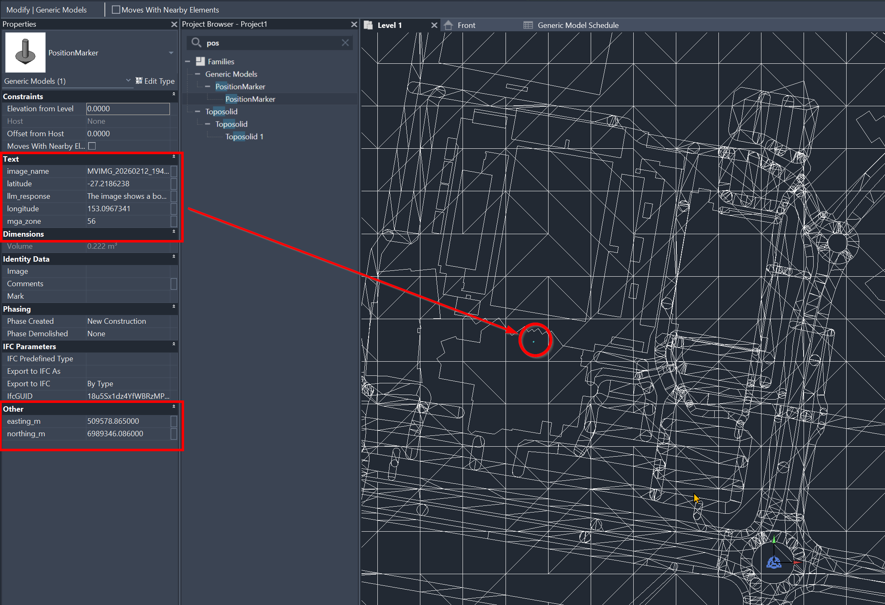
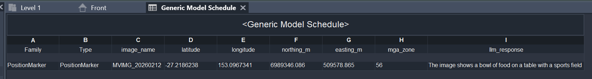

# From Photo to BIM: Extracting Structured Data from Imagery

A demonstration workflow for converting **unstructured photo data** into **structured, geolocated datasets** linked to BIM models.

The pattern applies to any domain where field photos need to be documented, geolocated, and brought into CAD/BIM platforms — asset management, construction documentation, infrastructure inspections, heritage surveys, and more.

---

## Demo

The notebook uses this photo (taken on a phone with GPS enabled) to demonstrate the workflow:


After extracting GPS, transforming coordinates, and running image analysis, a marker is placed in Revit at the photo's real-world location with the LLM description attached:



The marker's metadata (including the AI-generated description) appears in a Revit schedule:



## What It Does

1. **Extracts GPS coordinates** from photo EXIF metadata
2. **Converts coordinates** from WGS84 (GPS) to a local projected grid (e.g. MGA, UTM)
3. **Analyses images** using a vision-language model to generate structured descriptions
4. **Visualises locations** on an interactive map for validation
5. **Exports structured data** (CSV) for ingestion into Revit, Civil 3D, or GIS tools

---

## Quick Start

```bash
pip install -r requirements.txt
```

Create a `.env` file (see `.env.template`) with your API key, then open the notebook:

```bash
jupyter notebook photo_to_bim_workflow.ipynb
```

---

## Workflow

### 1. GPS Extraction

Most cameras embed GPS coordinates in JPEG EXIF metadata. The notebook reads these and converts from degrees-minutes-seconds to decimal degrees.

### 2. Coordinate Transformation

GPS uses **WGS84** (latitude/longitude). BIM platforms work in **projected coordinate systems** — flat grids measured in metres. The notebook converts between them using `pyproj`.

The example uses **MGA Zone 56 (GDA94)**, but any EPSG code can be substituted for your project's coordinate system.

### 3. Image Analysis

Images are resized (to meet API payload limits) and EXIF-stripped (for privacy — GPS data is never sent externally) before being submitted to a vision-language model via the Groq API.

### 4. Map Visualisation

An interactive Folium map plots each photo's location. Clicking a marker shows the image name and LLM-generated description — useful for quick validation before BIM import.

### 5. Export

The combined dataset (image name, GPS, projected coordinates, LLM response) is written to CSV. This is the format consumed by the included Dynamo graph for Revit integration.

---

## Dynamo to Revit Integration

A sample Dynamo graph (`Image_to_Revit_demo.dyn`) demonstrates how the exported data can be placed into a Revit model:

1. Reads the CSV via `Data.ImportExcel`
2. Converts metric coordinates to Revit internal units
3. Transforms from shared (survey) coordinates to project coordinates
4. Places a marker family instance at the computed location
5. Attaches the AI-generated description as an instance parameter

The graph assumes shared coordinates are already established in the Revit model.

---

## Requirements

- Python 3.10+
- A Groq API key (free tier available at [groq.com](https://groq.com))

---

## Caveats

- GPS accuracy depends on the capturing device (phone vs survey-grade drone)
- Coordinates represent the **camera position**, not the exact location of observed features — offset correction may be needed
- Vision models can **identify and classify** what they see, but **cannot reliably measure dimensions** without additional inputs
- This is a demonstration workflow, not a production system — outputs should be reviewed by qualified professionals before use
